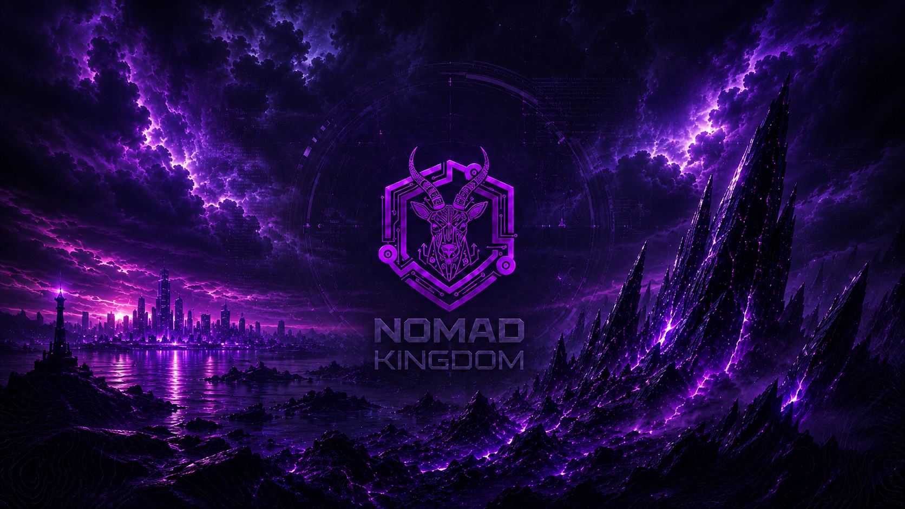

# KaliPWM Obsidian

**A dark, telemetry-first Kali Linux workspace built for offensive-security labs, CTFs, research and daily security work.**

KaliPWM Obsidian started as a fork of [`afsh4ck/kalipwm`](https://github.com/afsh4ck/kalipwm), but this repository is being developed as its own opinionated desktop environment rather than a visual copy of the upstream project.

The goal is simple: take a clean Kali installation and turn it into a repeatable, keyboard-driven workstation with an Obsidian visual language, useful live telemetry, fast target/VPN awareness and predictable behavior across bare metal and virtual machines.


## What makes this fork different

KaliPWM Obsidian is moving beyond a one-shot theme installer. The project is being shaped around four principles:

- **Operational first** — the desktop should surface information useful during real security work, not just look good.
- **Repeatable** — a fresh VM and a physical Kali machine should converge on the same working environment.
- **Minimal friction** — common actions such as setting a target, changing wallpaper, checking VPN state or launching tools should take one command or shortcut.
- **Maintainable** — installation, diagnostics, rollback and documentation should evolve together instead of accumulating machine-specific fixes.

## Screenshots

These are real screenshots captured while testing this fork. They are not inherited from the upstream project.

### Obsidian on the primary Kali host


### Obsidian in VMware


### Obsidian v2 Polybar


## Current Obsidian experience

The current stable `main` includes:

- BSPWM with Roman-numeral workspaces `I` through `X`.
- Obsidian v2 Polybar with Wi-Fi interface/IP, VPN telemetry, Target state, CPU/GPU data, temperatures, fan RPM, RAM, audio, battery/AC and time.
- Hardware-adaptive right-side telemetry: GPU and fan modules are included only when readable telemetry is available, avoiding dead `N/A` blocks on unsupported hardware.
- Persistent per-user Target state that does **not** depend on VPN connectivity.
- Obsidian Rofi launcher and compact power confirmation UI.
- Rofi-based KaliPWM Control Center on `Super + Space` with Network, VPN, Target, Wallpaper, Screenshot, Display, Audio, System, Diagnostics and Power sections.
- Selectable City and Nomad Kingdom wallpaper families.
- Persistent wallpaper choice across BSPWM sessions.
- Standalone runtime wallpaper switching that never starts the installer.
- Flameshot as the default interactive screenshot workflow, including region selection, annotation, clipboard copy and save actions.
- `kalipwm doctor` as a read-only system and configuration diagnostic command.
- `kalipwm update` for fast-forwarding the local checkout and refreshing only KaliPWM-managed files without reinstalling the toolchain.
- `kalipwm repair` for safely refreshing managed configuration, executable permissions and helper symlinks while quarantining recognized legacy PATH shadows.
- `kalipwm backup`, `kalipwm backups` and `kalipwm rollback` for timestamped managed-configuration snapshots and reversible rollback.
- Automatic `pre-update`, `pre-repair` and `pre-rollback` safety snapshots around destructive managed-file changes.
- Environment-aware BSPWM startup that preserves the display geometry provided by X instead of forcing a legacy `Virtual1` mode, and only starts the VMware session helper when VMware is actually detected.
- Idempotent installer reruns that reuse existing components instead of destructively recloning/rebuilding them.
- CI-enforced shell-quality checks covering maintained shell syntax, ShellCheck, brightness regression, installer failure handling and dependency-lock validation.
- Reproducible fresh-install dependency pins in `DEPENDENCIES.lock`, including checksum verification for the pinned Kitty bundle; existing working third-party checkouts are reported but deliberately left unchanged.
- Fail-fast installer reporting that identifies the failed stage/command and points to Doctor and backup/rollback recovery instead of attempting a surprise automatic rollback.
- Kitty + Powerlevel10k + Oh My Zsh workflow.
- Native `/usr/bin/cat` and `/usr/bin/vim` behavior.
- Dedicated Nerd Font sizing for compact telemetry and larger status icons.

## Wallpaper collection

The bundled Obsidian wallpaper library lives under [`WALLPAPERS/obsidian/`](WALLPAPERS/obsidian/).

Current families include:

- Obsidian City — 16:9 and ultrawide
- Nomad Monolith — standard and 16:9
- Nomad Emblem — standard and 16:9

Example:



## Installation

A clean or fresh Kali Linux installation is still the simplest starting point, but the installer is now safe to rerun on an existing KaliPWM installation without destructively rebuilding the full environment.

Run the installer as your normal user. **Do not run `kalipwm.sh` with `sudo`**; the installer requests elevation only where required.

```bash
git clone https://github.com/daviosardinha/kalipwm.git
cd kalipwm
bash kalipwm.sh
sudo reboot
```

After reboot, select **BSPWM** from the login session menu.

Rerunning the installer reuses existing Oh My Zsh, Powerlevel10k, Zsh plugins, fzf, tmux, Kitty, installed Nerd Fonts and existing Polybar/Picom installations where possible. Required packages remain ensured through APT, while KaliPWM-managed configuration, helper symlinks and wallpapers are reapplied. A plain rerun preserves the saved wallpaper choice.

To choose a wallpaper during a full installation:

```bash
bash kalipwm.sh --install-wallpaper nomad-monolith-16x9
```

To inspect installer options:

```bash
bash kalipwm.sh --help
```

The installer output is maintained in English and credits both the original `afsh4ck/kalipwm` project and the current KaliPWM Obsidian fork.

Fresh third-party Git installations are resolved from the revisions recorded in [`DEPENDENCIES.lock`](DEPENDENCIES.lock) instead of arbitrary moving upstream branches. Existing working checkouts are never reset just to match the lock; KaliPWM reports the drift and leaves them untouched. The bundled Kitty installer uses the locked version and verifies the downloaded Linux archive with SHA-256 before extraction.

Fatal installer commands now stop the run immediately with the current installation stage, failing command and exit code. KaliPWM does not automatically roll back a partial install: existing files remain as-is so the reported problem can be fixed, inspected with `kalipwm doctor` and recovered with an existing backup/rollback when necessary.

## Diagnostics

KaliPWM installs the management command under `/usr/local/bin/kalipwm`.

Run the read-only diagnostic report with:

```bash
kalipwm doctor
```

The doctor checks the current Kali/X11 environment, virtualization and connected-display geometry, BSPWM/sxhkd/Polybar/Picom/Rofi/Flameshot, managed KaliPWM helpers, Obsidian configuration, Nerd Fonts, Target and wallpaper state, network/VPN interfaces, optional hardware telemetry and known machine-specific BSPWM assumptions.

Status levels are intentionally different:

- `[OK]` — expected component or managed state is healthy.
- `[INFO]` — informational state or optional hardware capability.
- `[WARN]` — non-fatal drift, shadowing or machine-specific configuration worth fixing.
- `[FAIL]` — a required managed component is missing or broken.

`kalipwm doctor` never uses `sudo` and never changes configuration. It exits with code `1` when one or more `FAIL` findings are present; warnings alone keep a successful exit code.

The diagnostic logic has been validated on both the representative VMware Kali VM and the primary bare-metal Kali host. It now verifies that no legacy hard-coded `Virtual1` output remains and distinguishes a VMware helper protected by virtualization detection from an unguarded VM-specific startup command.

## Hardware and VM awareness

KaliPWM no longer forces a fixed `Virtual1` output or a `1920x1080` mode during BSPWM startup. The active X session keeps control of the connected output names, native/dynamic resolution and multi-monitor state.

VMware-specific desktop integration is also guarded at runtime: `vmware-user-suid-wrapper` is launched only when `systemd-detect-virt` reports VMware and the helper exists. On bare metal, the VMware helper remains inactive. Other virtualization types are reported diagnostically without enabling VMware-specific behavior.

This startup policy was validated by restarting BSPWM on both the representative VMware VM and the primary bare-metal host. VMware retained its dynamic `Virtual-1` geometry and active desktop integration, while bare metal retained its native `eDP-1` geometry and started no VMware desktop process. Both systems finished the updated Doctor checks with zero warnings and zero failures.

## Update workflow

Once KaliPWM is installed from a Git checkout, update it with:

```bash
kalipwm update
```

The update command requires a clean checkout, fetches and fast-forwards the local `main` branch from `origin/main`, then reapplies only KaliPWM-managed configuration, wallpapers, helper symlinks, shell configuration and `/usr/local/bin/kalipwm`.

Immediately before managed files are replaced, update creates a timestamped configuration snapshot labeled `pre-update` under `~/.config/kalipwm/backups/`. If deployment later needs to be reversed, that snapshot can be restored with `kalipwm rollback`.

It deliberately does **not** run APT, reinstall Nerd Fonts, rerun the full installer or rebuild third-party components such as Polybar and Picom. Target state and the persisted wallpaper choice under `~/.cache/kalipwm/` are preserved.

By default the checkout is expected at `~/kalipwm`. A different checkout can be supplied explicitly:

```bash
kalipwm update --repo /path/to/kalipwm
```

If the checkout contains tracked or untracked local changes, the command stops before fetching/deploying and asks you to commit, stash or remove them first.

## Repair workflow

Repair KaliPWM-managed desktop state without rerunning the full installer:

```bash
kalipwm repair
```

The repair command refreshes managed configuration, wallpapers, executable permissions, `/usr/bin/target`, `/usr/bin/screenshot`, `/usr/bin/wallpaper` and `/usr/local/bin/kalipwm`. It does **not** run APT, reinstall packages, download fonts or rebuild third-party software.

Before a real repair changes managed files, KaliPWM creates a timestamped `pre-repair` snapshot under `~/.config/kalipwm/backups/`. `kalipwm repair --dry-run` only shows the plan; it does not create a snapshot, modify files or use `sudo`.

Recognized legacy `~/.local/bin` helper symlinks that shadow the canonical KaliPWM commands are moved into a timestamped quarantine under `~/.cache/kalipwm/repair-backups/` instead of being deleted. Regular files and unrecognized symlink destinations are left untouched for manual review.

Preview the repair plan without `sudo` or any modifications:

```bash
kalipwm repair --dry-run
```

As with update, an alternate checkout can be selected explicitly:

```bash
kalipwm repair --repo /path/to/kalipwm
```

Target state and the persisted wallpaper choice are intentionally outside the repair path and remain unchanged.

## Backup and rollback workflow

Create a manual snapshot of the current KaliPWM-managed configuration:

```bash
kalipwm backup
kalipwm backup --label before-lab-change
```

List available snapshots, newest first:

```bash
kalipwm backups
```

Snapshots are stored per user under:

```text
~/.config/kalipwm/backups/<timestamp>-<label>/
```

The snapshot scope is deliberately narrow. It includes KaliPWM-managed BSPWM, Kitty, Picom, Polybar and sxhkd configuration, `.zshrc`, `.p10k.zsh`, `.tmux.conf.local`, plus the canonical `/usr/bin/{target,screenshot,wallpaper}` helper links. It does not sweep unrelated `~/.config` content, shell history, browser data, Target state or wallpaper-choice state. Snapshot creation uses a private `umask 077`; if a user manually places a secret inside one of the managed configuration files, that content is naturally included in the private snapshot.

Preview a rollback without changing anything or using `sudo`:

```bash
kalipwm rollback latest --dry-run
kalipwm rollback 20260827-155036-baremetal-baseline --dry-run
```

Restore the latest or a specific snapshot:

```bash
kalipwm rollback latest
kalipwm rollback 20260827-155036-baremetal-baseline
```

A real rollback first creates another timestamped snapshot labeled `pre-rollback`, then restores the requested managed state. This makes rollback itself reversible: the state that existed immediately before restoration remains available as another snapshot.

Automatic safety snapshots use the labels `pre-update`, `pre-repair` and `pre-rollback`. Target and persisted wallpaper-choice state remain outside all of these snapshots and are not modified by rollback.

## Wallpaper workflow

List the bundled choices:

```bash
wallpaper list
```

Current wallpaper names:

| Selector | Wallpaper |
|---|---|
| `auto` | Automatically chooses the City variant based on monitor geometry |
| `city-16x9` | Obsidian City 16:9 |
| `city-ultrawide` | Obsidian City ultrawide |
| `nomad-monolith` | Nomad Monolith standard |
| `nomad-monolith-16x9` | Nomad Monolith 16:9 |
| `nomad-emblem` | Nomad Emblem standard |
| `nomad-emblem-16x9` | Nomad Emblem 16:9 |

Change the wallpaper at runtime:

```bash
wallpaper nomad-emblem-16x9
wallpaper nomad-monolith-16x9
wallpaper city-16x9
wallpaper auto
```

The installer also exposes the same runtime action explicitly:

```bash
bash kalipwm.sh --wallpaper nomad-emblem-16x9
```

`--wallpaper` changes only the wallpaper and exits. It does **not** run package installation or reinstall KaliPWM. Use `--install-wallpaper NAME` only when selecting the wallpaper for a full installation.

The chosen wallpaper is stored under `~/.cache/kalipwm/` and restored automatically by BSPWM.

## Screenshot workflow

Flameshot is installed by KaliPWM and launched on demand by the screenshot helper. KaliPWM does not require a persistent Flameshot background process; the process may remain resident after a capture or exit, and either state is valid.

```bash
screenshot
screenshot select
screenshot full
screenshot screen
screenshot window
```

`screenshot` and `screenshot select` open the native Flameshot interactive interface. `screenshot full` and `screenshot screen` save non-interactive captures under `~/screenshots/`. Because Flameshot does not expose a native active-window CLI mode, `screenshot window` falls back to interactive region selection.

Inside the Flameshot interface, native shortcuts such as `Ctrl + C` for clipboard copy, `Ctrl + S` for save and the standard annotation tools remain available.

## Target workflow

Set a target:

```bash
target 10.10.10.10
```

Polybar displays:

```text
Target 10.10.10.10
```

Read or clear it:

```bash
target
target reset
```

Target state is local desktop state stored per user under `~/.cache/kalipwm/`. It works with or without an active VPN.

## Obsidian Polybar v2

The bar is deliberately compact. Detailed sensor information remains available from the underlying tools, while Polybar focuses on the information that is useful at a glance:

- Wi-Fi interface + local IP
- VPN interface + VPN IP
- current Target
- CPU usage + temperature
- GPU usage + temperature when readable telemetry is available
- fan RPM when readable fan sensors are available
- used RAM
- volume
- AC/battery state
- time
- power menu

The right-side module list is built at launch time. GPU and fan modules are omitted when their telemetry is unavailable; supported hardware renders normally without leaving `N/A` placeholders. The fan helper scans readable `/sys/class/hwmon/hwmon*/fan*_input` sensors and reports the highest current RPM in a compact block.

The hardware-adaptive layout was validated on the primary bare-metal host, including a fresh reboot. After reboot the bar restored the adaptive GPU/fan layout and live fan telemetry successfully.

## Main shortcuts

> On macOS-hosted keyboards, substitute Windows/Super with Command where appropriate and Alt with Option.

| Shortcut | Action |
|---|---|
| `Super + Enter` | Open Kitty |
| `Super + D` | Open the Obsidian launcher |
| `Super + Space` | Open the KaliPWM Control Center |
| `Super + Arrow keys` | Move focus between windows |
| `Super + Tab` | Return to the previous desktop |
| `Super + Alt + R` | Reload the desktop environment |
| `Super + Alt + Q` | Restart/quit BSPWM according to the configured binding |
| `Super + Alt + Arrow keys` | Resize the focused window |
| `Super + Shift + F` | Open Firefox |
| `Super + Shift + B` | Open Burp Suite |
| `Super + Shift + A` | Open Thunar |
| `Print` | Open interactive Flameshot selection |
| `Ctrl + Print` | Open interactive Flameshot selection |
| `Alt + Print` | Open interactive Flameshot selection for window/region capture |

## Project roadmap

The detailed roadmap lives in [`ROADMAP.md`](ROADMAP.md), while completed user-visible changes are recorded in [`CHANGELOG.md`](CHANGELOG.md).

At a glance:

- ✅ Obsidian v2 desktop and Polybar foundation
- ✅ Target state and VPN-independent target display
- ✅ Obsidian wallpaper library and persistent selection
- ✅ Rofi power-menu cleanup
- ✅ Flameshot as the default screenshot workflow
- ✅ standalone wallpaper command / installer separation
- ✅ English-only source and CLI cleanup
- ✅ `kalipwm doctor` diagnostics
- ✅ idempotent installer reruns
- ✅ `kalipwm update`
- ✅ `kalipwm repair`
- ✅ configuration backup and rollback
- ✅ dynamic display handling and VMware-aware BSPWM startup
- ✅ hardware-adaptive Polybar modules
- ✅ Rofi-based KaliPWM Control Center
- ✅ security and maintainability hardening
- ✅ public release validation and a tagged `v1.0.0`

## Project language

**English is the only language used for KaliPWM Obsidian documentation, maintained source comments and user-facing CLI output.**

The maintained installer and repository content have been audited for the legacy non-English strings inherited from upstream. Future changes must continue to use English for documentation, maintained comments and user-facing text.

## Documentation policy

Documentation is part of the definition of done for this project.

When a task is validated and lands on `main`, the same completion cycle must update the relevant README, roadmap and/or changelog entry. Features that are still experimental stay marked as **in progress** and must not be documented as stable until they are merged into `main`.

This keeps the public repository aligned with what a fresh clone can actually reproduce.

## Core components

- BSPWM
- Polybar
- Rofi
- sxhkd
- Picom
- Kitty
- Oh My Zsh + plugins
- Powerlevel10k
- Hack Nerd Font
- JetBrainsMono Nerd Font
- Vim
- tmux
- Python / pip / bpython
- lsd
- Fastfetch
- Flameshot
- feh
- lm-sensors
- pavucontrol

## Credits and license

KaliPWM Obsidian is a fork and modified continuation of KaliPWN/KaliPWM by **afsh4ck**.

- Original project: [`afsh4ck/kalipwm`](https://github.com/afsh4ck/kalipwm)
- Original author: afsh4ck
- This fork: `daviosardinha/kalipwm`
- License: MIT

The upstream project deserves full credit for the original foundation; the Obsidian design, telemetry layout, wallpaper system, Target workflow changes and ongoing reliability roadmap are specific to this fork.